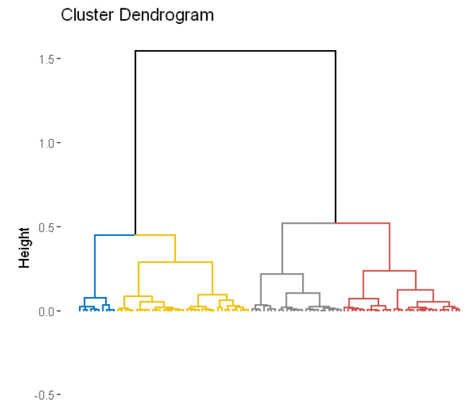
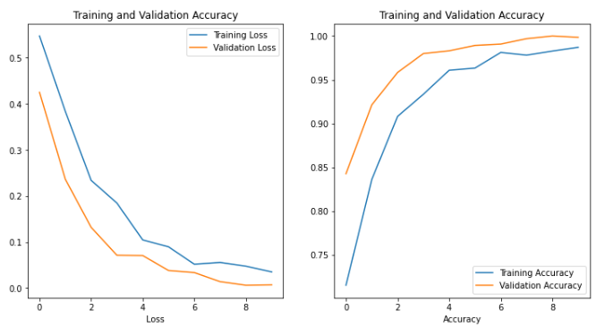

<h1 align="center">Recent Data Science and Machine Learning Projects</h1>

# [1.Statistical Case Study on Learners Engagements in MOOCs:](https://github.com/AmrMohamed226/Statistical-Case-Study-on-Learners-Engagements-in-MOOCs)
- Performed a statistical case studyon a real-life dataset of learners' engagement behavior in a MOOC. 

- Analyzed the learners' genders, countries' Human Development Index (HDI), and socioeconomic status effect on their engagement behavior through a vareity of statistical techniques including a survival analysis.

  

  

# [2.Social Networks Analysis for French Higher Education System:](https://github.com/AmrMohamed226/Social-Networks-Analysis-for-French-Higher-Education-System)
- Applied several Social Networks Analysis techniques such as edgelists, community detection, and the different centrality measures to analyze the social networks in the French higher education systems.

  
  
  
  

# [3.NLP and Machine Translation Systems:](https://github.com/AmrMohamed226/NLP-and-Machine-Translation-systems)
- Used European Parliament proceedings corpus of parallel text to apply different Natural Language Processing (NLP) Techniques such as N-gram models. 

- Implemented IBM model-1 for Statistical Machine Translation was coded to calculate word allignment probabilities between from English to French Language corpuses. 

- Implemented a decoding technique to decode the text back from French to English.

# [4.Dating Website Profiles Analysis with Dimensionality Reduction and Clustering:](https://github.com/AmrMohamed226/Dating-website-profiles-analysis-with-Dimensionality-reduction-and-Clustering) 
- Used a dataset of an mythical dating application was used to perform the different techniques of Dimensionality Reduction

- Applied K-means and Hierarchical clustering techniques to cluster the data, and identify the similarities between the different data groups.

  
  
  

  
  
  

# [5.Sentiment Classification for Restaurant Reviews:](https://github.com/AmrMohamed226/Sentiment-Classification-for-Restaurant-Reviews)
- Implemented a sentiment classification system to classify restaurants reviews as positive/negative in a supervised learning setting.

- Used restaurant reviews data that was annotated by 2 different annotators, present in the data in the annotation column as (annotator1/annotator2).
- Calculated the percentage of disagreement between the annotators, and investigated the rows that had disagreements. 

- Trained and cross-validated several models, and hyper-parameter tuned the best performing models.

- Evaluated the best performing model on the testing set using a confusion matrix along with Precision/Recall curves.

- Investigated the features (words) highest contributing to the model preddictive power for model interpretability.

  
  

  
  

# [6.Adult-salary prediction and Random Forest investigation:](https://github.com/AmrMohamed226/Adult-salary-prediction-and-Random-Forest-investigation) 
- Used [UCI](http://archive.ics.uci.edu/ml/index.php)'s [
Adult Data Set](http://archive.ics.uci.edu/ml/datasets/Adult) to predict whether an American individual earns more than $50,000 a year given a number of numerical and categorical features (A binary-calassification task).

- Trained and tuned the hyper-parameter of several classifiers to find the best performing classifier. 

- Investigated Random Forest and Decision Trees were closely for their viability to overfitting, hyperparameters , max_depth for Decision Trees, and n_estimators for Random Forest, and discussed about feature importance for each of the models.

  

# [7.ML workflow and Decision Trees:](https://github.com/AmrMohamed226/ML-workflow-and-Decision-Trees)
- Went through the work-flow of a Machine Learning project for each of the classification and regression settings using the datasets [UCI](http://archive.ics.uci.edu/ml/datasets.php)'s datasets [Cardiotocography Data Set](https://archive.ics.uci.edu/ml/datasets/Cardiotocography) of fetal heart diagnosis for the classification setting, and [Kaggle](https://www.kaggle.com/)'s [Sberbank Russian Housing Market](https://www.kaggle.com/c/sberbank-russian-housing-market/overview) that consists of statistics from the Russian real estate market.

- Explored each of the datasets.

- Trained a baseline classifier.

- Trained cross-validated, and hyper-parameter tuned plenty of models for each set to find the best-performing model for each of the two problems.

- Implemented Decision Tree classes using OOP for each classification and regression setting, and investigated their viability to underfitting/overfitting and plotting to graph them for more interpretability.

  

# [8.Perceptron and SVM implementation:](https://github.com/AmrMohamed226/Perceptron-and-SVM-implementation/edit/main/README.md)

- Implemented the Pegasos algorithm for training support vector classifiers using OOP including the implementation of its hinge loss function for sentiment data classification of customer reviews on music albums as positive or negative. In addition, the Logistic regression model was implemented using OOP including the log loss function on the same data.

- Tackled the bottlenecks in the code are the linear algebra operations: computing the dot product, scaling the weight vector, and adding the feature vector to the weight vector by:
    - Replacing orinary numpy mathematical operations with linear algebra operations from [Scipy](https://docs.scipy.org/doc/scipy/reference/linalg.blas.html).
    - Using sparse vectors.
    - Replacing the vector scaling operations with blas functions.

# [9.Movies Recommender System:](https://github.com/AmrMohamed226/Movies-Recommender-System) 
- Implemented a movies user-based recommender system that uses user-based collaborative filtering to recommend unwatched movies to users based on similar movies rating history between them and other users using K-NN algorithm and its variant K-NN with means.

# [10.Text Mining and NLP for French Higher Education Theses Processing and Similarities Detection:](https://github.com/AmrMohamed226/Text-Mining-and-NLP-for-French-Higher-Education-Theses-Processing-and-Similarities-Detection) 
- Web-scraped 50 PhD theses that were defended in French higher institutions in form of PDFs from [theses.fr](https://theses.fr/).

- Converted the PDFs to text files, detected their script languages, and  examined their scripts through TF-IDF vectorization and N-gram probabilities (bigrams, trigrams, and quadrigrams). 

- Performed a document similarity analysis on a chosen 10 theses by calculating the cosine similarities between each document of the 10 and the rest.

  

# [11.CNN for Brain Tumor Classification:](https://github.com/AmrMohamed226/CNN-for-Brain-Tumor-Classification)
- Implemented a convolutional neural network (CNN) for classifying brain tumors as healthy/tumorous based on X-ray image using the [Brian Tumor Dataset](https://www.kaggle.com/datasets/preetviradiya/brian-tumor-dataset) from Kaggle for model training, validation, and evaluation, where accuracies of 98.7%, 99.8%, and 99.6% were achieved on the training, validation, and testing datasets respectively. 

- Used specifity, sensetivity, and precision metrics were used for model performance evaluation.

  

# [12.Diagnostic Systems for Breast Cancer Diagnosis:](https://github.com/AmrMohamed226/Diagnostic-Systems-for-Breast-Cancer-Diagnosis)
- Used [Breast Cancer Wisconsin (Diagnostic) Data Set](https://archive.ics.uci.edu/ml/datasets/Breast+Cancer+Wisconsin+(Diagnostic)) to build a breast cancer benign/malignant classifier model.

- Used [Carsten Eickhoff 2016](https://dl.acm.org/doi/pdf/10.1145/2594776.2594788?casa_token=GMtjoBep2nkAAAAA:7n4D47l-D5yDvNTHgw8KBqQwQd03KuJnYy3hXhBTKqv940MklIJFSsM0wuF4JA1wnL0qv3K3YDp_7g) paper was used to gain some domain expertise to help in understanding the physical differences between a benign and a malignant tumor.

- Tackled the interpretability problem in detail by using 3 predictor models with 3 different levels of interpretability.

  

# [13.Data Wrangling of French Higher Education Theses:](https://github.com/AmrMohamed226/Data-Wrangling-of-French-Higher-Education-Theses) 

- Web scraped, Analyzed, and applied data wrangling techniques on a of Ph.D. theses that were defended in France between the years 1971 and 2020.

- Preprocessed, cleaned, and spotted abnormalities and outliers in the data, and drew and tested assumptions using Data visualization and statistical methods.

  

  

# [14.CNN for Vehicle detection:](https://github.com/AmrMohamed226/CNN-for-Vehicle-detection)
- Built a Convolutional neural network for Vehicle detection by: 
    - Choosing the suitable CNN architecture.
    - Tackling overfitting using data augmentation.
    - Using [VGG-16](https://arxiv.org/abs/1409.1556) for **Transfer Learning** (a pre-trained CNN on [ImageNet competition](https://image-net.org/challenges/LSVRC/)).
    - Visualizing the learned features.

  

# [15.Dialogue system and Question answering system:](https://github.com/AmrMohamed226/Dialogue-system-and-Question-answering-system)
- Developped a dialogue system to perform 3 main functionalities: 
    <li>Finding a nearby restaurant</li>
    <li>Getting the weather forecast to a given city</li>
    <li>Find the next tram/bus to a given destination</li>

The 3 functionalities above are done using NLP for text understanding and named entity recognition, afterwards, a google search query is sent to get an answer for the user's question, and its result is then web-scraped.

The dialogue system work-flow is the following:

 **Step 1**: AI greets. 
 **Step 2**: User greets. 
 **Step 3**: AI requests help. 
 **Step 4**: User asks for information.  
 **Step 5**: If the AI understood the question, it grounds, else, it asks for question re-formalization. 
 **Step 6**: AI gets and displays the requested information, and asks if the user has other requests. 
 **Step 7**: If the user doesn't have other requests, the AI greets and ends the conversation, else the AI goes back to **Step 3**.
